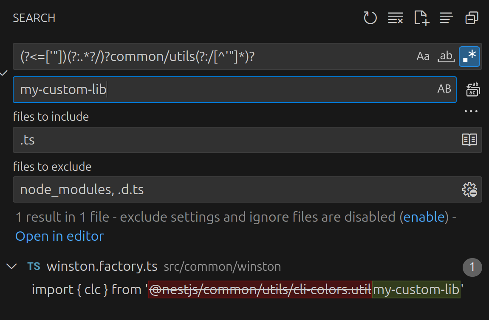

# Replace `import` Path With Another Path

- So I was refactoring our codebase and I had like a ton of places where I was importing a helper function from a relative path. Then I had created this library and put that helper function in it (in fact it contained all of my utility functions), so now the problem was that I ad to find all places where I was importing the aforementioned lib and replace the whole import with something like this: `my-custom-lib`. And like I said the relative paths were things like this: `../../common/utils/abc`, `./abc`, `../../../../common/utils/abc`, you get the idea. So what I did was two things:

  1. I installed this lib: [`eslint-plugin-import`](https://github.com/import-js/eslint-plugin-import/) and used their [`no-duplicates`](https://github.com/import-js/eslint-plugin-import/blob/main/docs/rules/no-duplicates.md) rule in combination with [`eslint-plugin-perfectionist`](https://github.com/azat-io/eslint-plugin-perfectionist) to automatically merge all duplicates (because I was importing each helper function directly I had like 2 or 3 imports from the same dir which now had to be merged into a single import).
  2. I used a regex in my VSCode to find all occurances of my helper functions imports: `(?<=['"])(?:.*?/)?common/utils(?:/[^'"]*)?` and then replaced them all.

     - `(?<=['"])` ensures the match only starts **after** a quote (', ") — so it won’t include the `import {...} from '` or similar.
     - `(?:.*?/)?` optionally captures any path-like prefix (e.g., ../../).
     - `(?:/[^'"]*)?` indicates that it should match anything unless it reaches another single quote or double quote.

     
